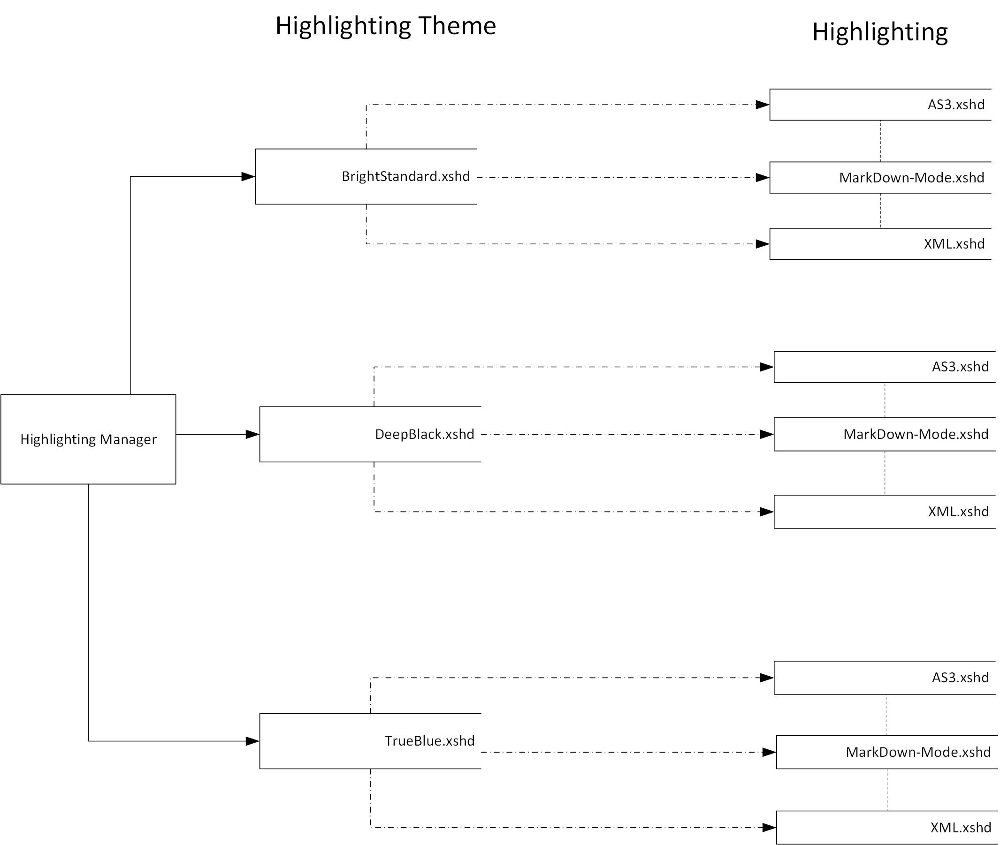

# AvalonEditHighlightingThemes
Implements a sample implementation for using Highlightings with different (Light/Dark) WPF themes

# Themes

## Dark Theme

## TrueBlue Light Theme

## Light Theme

## Dark Theme

## Data Design

