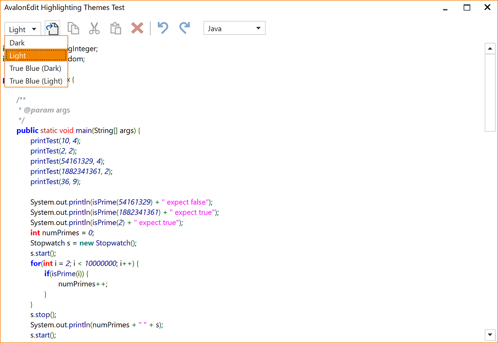
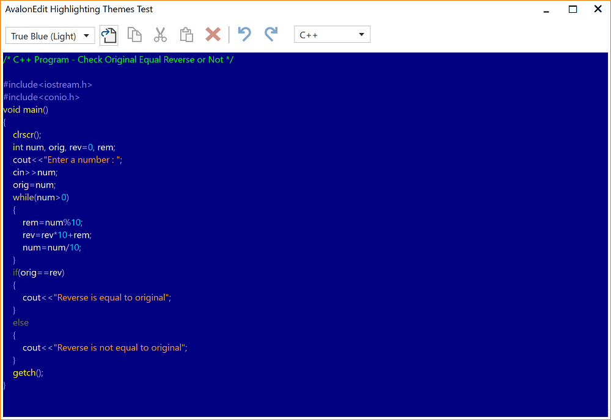
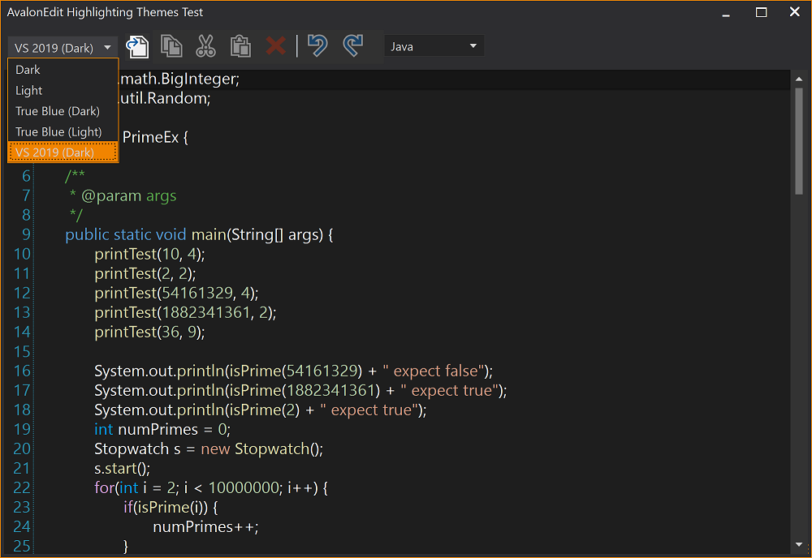
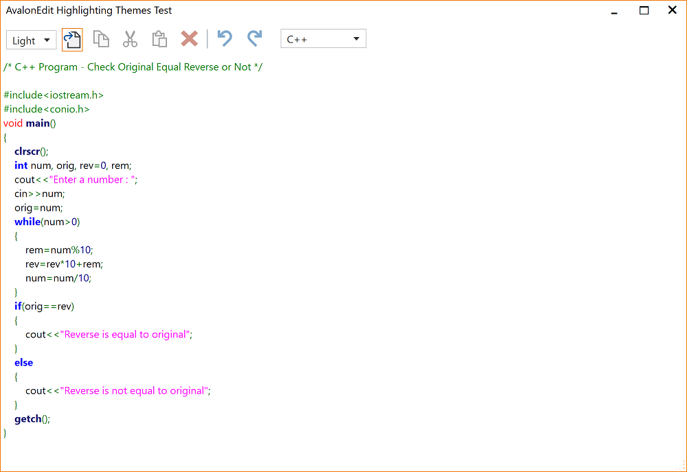
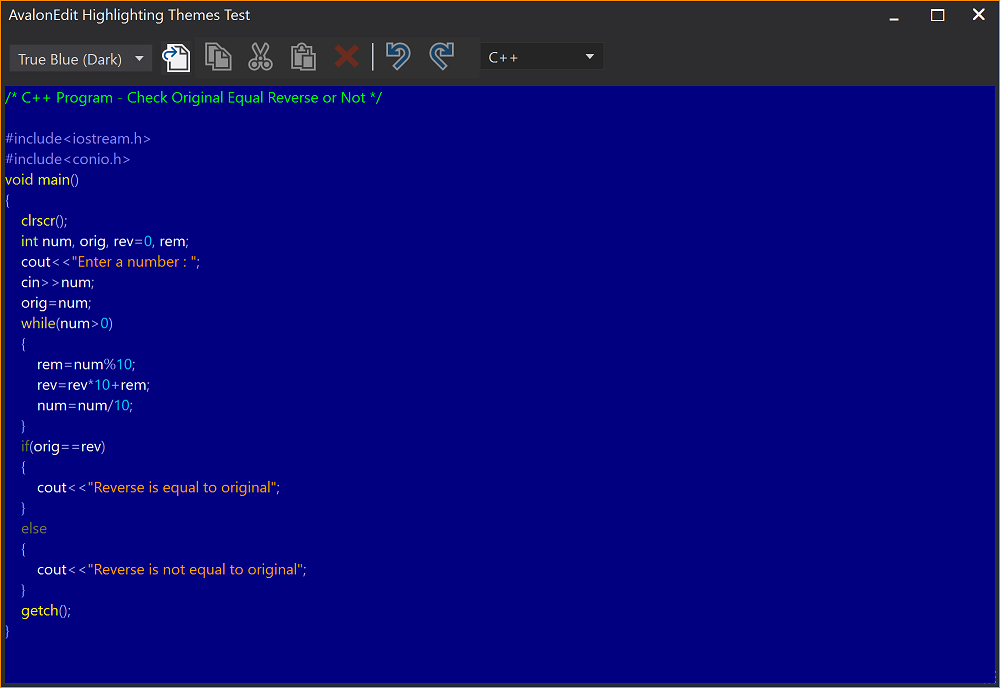
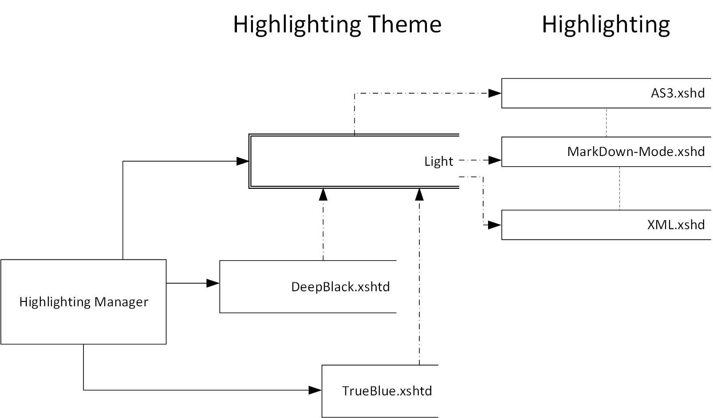
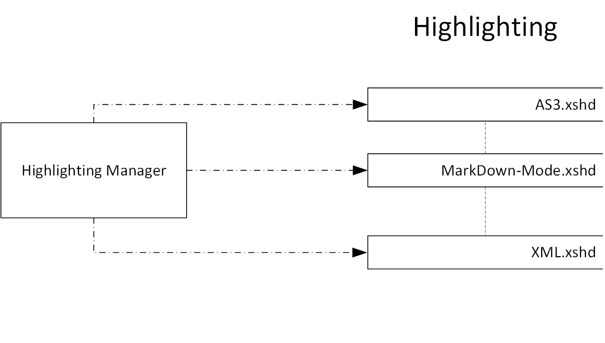

  

 

# AvalonEditHighlightingThemes
Implements a sample implementation for using Highlightings with different (Light/Dark) WPF themes

# ThemedHighlightingManager for AvalonEdit

This [AvalonEdit](https://github.com/icsharpcode/AvalonEdit) extension implements its own highlighting manager that extends the classic way of handling highlighting definitions (see also [Dirkster99/AvalonEdit-Samples](https://github.com/Dirkster99/AvalonEdit-Samples)).

The inital release contains 5 highlighting themes:
- Dark
- Light
- True Blue-Light
- True Blue-Dark
- VS 2019-Dark

but you can easily define more themes. Just create a pull request with the [XSHTD file](https://github.com/Dirkster99/AvalonEditHighlightingThemes/tree/master/source/HL/Resources/Themes) at this site.

The standard highlighting in AvalonEdit is dependent on the currently viewed type
of text (eg C# or SQL), but a highlighting definition designed for a **Light** WPF theme may look [ugly](https://github.com/Dirkster99/AvalonEditHighlightingThemes/wiki/Highlighting-without-a-Theme) if viewed with a **Dark**
WPF theme, and vice versa. This is why the **ThemedHighlightingManager** extension associates each highlighting definition
with:

- A WPF Theme (Light, Dark) and
- A type of text (C#, SQL etc)

This approach is very similar to the implementation in [Notepad++](https://github.com/notepad-plus-plus/notepad-plus-plus) except Notepad++ uses a plain [xml file](https://lonewolfonline.net/notepad-colour-schemes/) to configure a highlighting theme whereas the **ThemedHighlightingManager** uses an [XSHTD file](https://github.com/Dirkster99/AvalonEditHighlightingThemes/tree/master/source/HL/Resources/Themes) to do the same. But at the end of the day, its XML in both projects, and cloning a highlighting theme from Notepad++ is almost too easy (thats how similar both implementations are).

Assuming that an application already use a WPF theming/management library, such as:
- [MahApps.Metro](https://github.com/MahApps/MahApps.Metro),
- [MLib](https://github.com/Dirkster99/MLib), or
- [MUI](https://github.com/firstfloorsoftware/mui)

enables an applications author to switch highlighting definitions to a matching color palette whenever the user
switches a given WPF theme. See [AvalonEdit-Samples](https://github.com/Dirkster99/AvalonEdit-Samples)
and [Ähnlich](https://github.com/Dirkster99/Aehnlich) for detailed sample implementations.

# Themes

## True Blue Light Theme

## VS 2019 Dark

## Dark Theme

## Light Theme

## True Blue Dark Theme

# Concept
## WPF Theme

A WPF theme is a way of styling and theming WPF controls. This is usually implemented in a seperate library, such as:
- [MahApps.Metro](https://github.com/MahApps/MahApps.Metro),
- [MLib](https://github.com/Dirkster99/MLib), or
- [MUI](https://github.com/firstfloorsoftware/mui)

and takes advantage of WPFs way of defining and using themes ('Dark', 'Light', 'True Blue'...) with XAML resources etc.

## Generic Highlighting Theme

A Generic highlighting theme is a classic collection of AvalonEdit V2 highlighting definitions
(collection of xshd files). In this project, there is only one such theme, the **'Light'** highlighting
theme. This theme is defined in a classic collection of xshd resource files at 
[HL.Resources.Light](https://github.com/Dirkster99/AvalonEditHighlightingThemes/tree/master/source/HL/Resources/Light).

## Derived Highlighting Theme

A derived highlighting theme is a highlighting theme that makes use of a
[Generic Highlighting Theme](#Generic-Highlighting-Theme) and overwrites
formattings defined in named colors by incorporating an additional xsh**t**d file.

This approach re-uses the highlighting patterns of the generic theme but applies
different colors and formattings to better support:

- different background colors of different WPF themes or
- different taste towards different color schemes by different users

This project has multiple derived highlighting themes

- 'Dark'
- 'True Blue'
- 'VS 2019 Dark'

which are based on the highlighting patterns of the 'Light' generic highlighting theme.

## Data Design - Extension with Themable Highlighting

## Data Design - Classic Highlighting Manager V6.01

## Other AvalonEdit Demo Projects:

More demo projects may be listed at the [AvalonEdit's Wiki page](https://github.com/icsharpcode/AvalonEdit/wiki/Samples-and-Articles)
