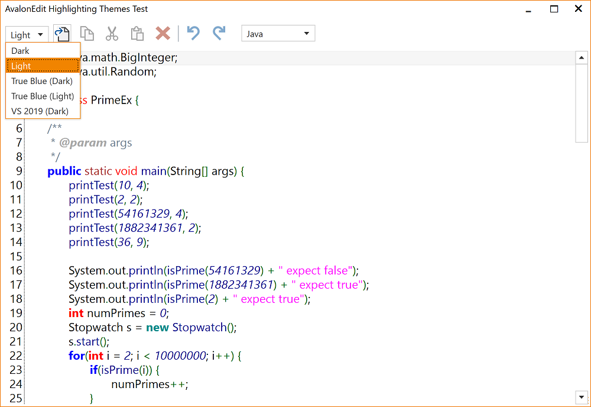

# AvalonEditHighlightingThemes
Implements a sample implementation for using Highlightings with different (Light/Dark) WPF themes

# Themes

## True Blue Light Theme

## Dark Theme

## Light Theme

## True Blue Dark Theme

# Concept
## WPF Theme

A WPF theme is a way of styling and theming WPF controls. This is usually implemented in a seperate library, such as:
- [MahApps.Metro](https://github.com/MahApps/MahApps.Metro),
- [MLib](https://github.com/Dirkster99/MLib), or
- [MUI](https://github.com/firstfloorsoftware/mui)

and takes advntage of WPFs way of defining and using themes ('Dark', 'Light', 'True Blue'...) with XAML etc.

## Generic Highlighting Theme

A Generic highlighting theme is a classic collection of AvalonEdit V2 highlighting definitions
(collection of xshd files). In this project, there is only one such theme, the **'Light'** highlighting
theme. This theme is defined in a classic collection of xshd resource files
[HL.Resources.Light](https://github.com/Dirkster99/AvalonEditHighlightingThemes/tree/master/source/Apps/HL/Resources/Light).

## Derived Highlighting Theme

A derived highlighting theme is a highlighting theme that makes use of a
[Generic Highlighting Theme](#Generic-Highlighting-Theme) and overwrites
formattings defined in named colors by incorporating an additional xsh**t**d file.

This approach re-uses the highlighting patterns of the generic theme but applies
different colors or formattings to better support:

- different background colors of different WPF themes or
- different taste towards different color schemes by different users

This project has at least 2 derived highlighting themes

- 'Dark'
- 'True Blue'

which are both based on the highlighting patterns of the 'Light' generic highlighting theme.

## Data Design

